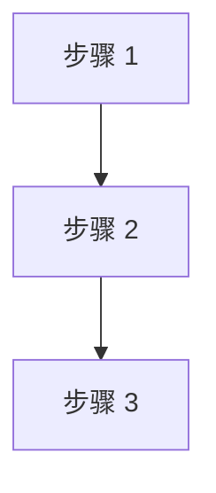

# [产品/功能名称]产品需求文档

文档修改记录

| 序号 | 版本号 | 修改时间 | 修改人 | 备注 |
| --- | --- | --- | --- | --- |
| 1 | V1.0 | [YYYY/M/D] | [姓名] | 初版 |

## 一、项目概述

### 1.1 项目背景

[描述业务背景、现状痛点、为何需要建设本能力。用条目列出核心问题。]

[说明与上下游系统/业务的关系；如有分阶段目标，可用表格或列表说明。]

### 1.2 项目目标

- **[目标 1]**：[可衡量的业务或用户价值]
- **[目标 2]**：[…]
- **[目标 3]**：[…]

### 1.3 目标用户

| **用户角色** | **描述** | **核心诉求** |
| --- | --- | --- |
| [角色 A] | [谁在什么场景下使用] | [最关心什么] |
| [角色 B] | […] | […] |

### 1.4 成功指标（可选，复杂项目建议写）

| **指标** | **定义** | **当前基线** | **目标值** | **观测方式** |
| --- | --- | --- | --- | --- |
| [北极星指标] | [如何计算] | [—] | [上线后 X 个月达到 Y] | [埋点/报表/工单] |

---

## 二、系统总体架构

### 2.1 架构图

```plaintext
[ASCII 或说明：核心组件、数据流向、与外部系统关系]
```

### 2.2 技术栈

| **层级** | **技术选型** | **说明** |
| --- | --- | --- |
| [后端/服务] | [语言 + 框架] | [选型理由简述] |
| [数据库] | [类型] | […] |
| [消息/缓存] | [如有] | […] |
| [部署] | [Docker/K8s 等] | […] |

### 2.3 核心业务流程

#### 2.3.1 [流程名称]

[文字说明；复杂流程用 mermaid flowchart]



#### 2.3.2 [其他关键流程]

[按需补充]

### 2.4 非功能需求（概要）

| **类别** | **要求** |
| --- | --- |
| 性能 | [如：接口 P95 < 500ms] |
| 可用性 | [如：核心链路 99.9%] |
| 安全 | [认证、鉴权、敏感数据] |
| 可观测性 | [日志、指标、告警] |

---

## 三、功能需求详述

> 按模块拆分；每个模块包含：设计原则（如有）、字段/规则表、异常与边界、与其他模块关系。

### 3.1 [功能模块 A]

**设计原则：**

- [原则 1]
- [原则 2]

#### 3.1.1 [子功能/接口/规则名称]

| 字段 | 类型 | 必填 | 说明 |
| --- | --- | --- | --- |
| [field] | [string/int/…] | 是/否 | [业务含义与约束] |

**业务规则：**

- [规则 1]
- [规则 2]

**异常与边界：**

- [场景] → [系统行为]

#### 3.1.2 [子功能 B]

[同上结构，按需展开]

### 3.2 [功能模块 B]

[…]

### 3.x 用户故事（可选，适合面向终端用户的功能）

##### [故事标题]

**用户故事：**

```
作为 [用户角色]，
我希望 [执行动作]，
以便 [获得价值]。
```

**验收标准：**

- [ ] [可测试条件 1]
- [ ] [可测试条件 2]

**优先级：** 必须 / 应该 / 可以  
**依赖：** [无 / 列出依赖项]

---

## 四、接口设计（概要）

### 4.1 [接口分组名称]

| 方法 | 路径 | 说明 |
| --- | --- | --- |
| POST | `/api/v1/[resource]` | [用途] |
| GET | `/api/v1/[resource]/{id}` | [用途] |

**请求/响应要点：** [或附 JSON 示例]

### 4.2 与外部系统对接

| 外部系统 | 对接方式 | 说明 |
| --- | --- | --- |
| [系统名] | [HTTP/消息/文件] | […] |

---

## 五、数据模型设计（概要）

### 5.1 [实体 A]

| 字段 | 类型 | 说明 | 索引/约束 |
| --- | --- | --- | --- |
| id | string | 主键 | PK |
| [field] | [type] | […] | [UK/索引] |

**实体关系：** [一对一 / 一对多 / 说明]

### 5.2 [实体 B]

[…]

---

## 六、不在此范围的功能（由业务系统自行实现或后续版本）

- [明确排除项 1 及原因]
- [明确排除项 2 及原因]
- [后续版本考虑项，标注「规划」]

---

## 七、第一版功能范围

### 7.1 本期包含

| 编号 | 功能点 | 说明 |
| --- | --- | --- |
| F-001 | [功能] | [简述] |

### 7.2 本期不包含

| 编号 | 功能点 | 原因/后续计划 |
| --- | --- | --- |
| O-001 | [功能] | [第二期 / 由 XX 系统负责] |

### 7.3 验收标准（第一期）

- [ ] [端到端可验证的交付标准 1]
- [ ] [交付标准 2]
- [ ] [非功能验收项]

### 7.4 里程碑与排期（可选）

| 阶段 | 交付物 | 负责人 | 计划时间 |
| --- | --- | --- | --- |
| 需求评审 | PRD 定稿 | PM | [日期] |
| 开发 | [核心能力] | 研发 | [日期] |
| 联调/上线 | […] | […] | [日期] |

---

## 八、附录

### 8.1 术语表

| 术语 | 定义 |
| --- | --- |
| [术语] | [解释] |

### 8.2 开放问题

| 编号 | 问题 | 负责人 | 期望结论时间 |
| --- | --- | --- | --- |
| Q-001 | [待决策项] | [姓名] | [日期] |

### 8.3 风险与应对

| 风险 | 影响 | 概率 | 应对策略 | 负责人 |
| --- | --- | --- | --- | --- |
| [风险描述] | 高/中/低 | 高/中/低 | [措施] | [姓名] |

### 8.4 参考资料

- [调研文档、竞品、接口文档链接]

---

## 模板使用说明

**适用：** 新系统、跨团队功能、集成类需求、需研发对齐的 B 端/平台类 PRD。

**精简版：** 小需求可只保留「一、项目概述」「三、功能需求（单节）」「七、第一版范围与验收标准」。

**英文 PRD：** 用户明确要求英文时，使用 `references/prd_template_en.md`。
